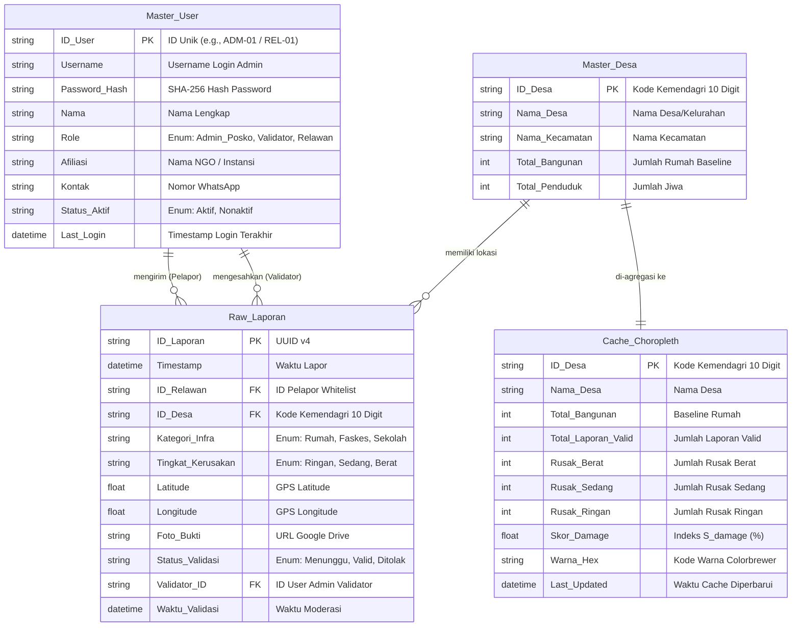

# Product Requirements Document (PRD) & Technical Specifications

**Nama Produk:** Peta Sebaran Kerusakan Infrastruktur (Choropleth Damage Assessment)  
**Platform:** 100% Full-Stack Google Apps Script (Frontend `HtmlService` + Backend `Code.gs` + Database Google Sheets + File Storage Google Drive)  
**Kategori:** Open-Source Disaster Management Tool (Zero-Server-Cost Architecture)  
**Versi:** 3.1 (Spesifikasi Arsitektur Pure Google Apps Script + Admin Authentication)

---

## 1. Ringkasan Eksekutif & Arsitektur Pure-GAS

Pada kondisi tanggap darurat bencana di wilayah kepulauan (seperti Nusa Tenggara Timur), ketersediaan anggaran server, infrastruktur cloud berbayar, serta tim DevOps sangat terbatas. Platform ini dirancang khusus untuk berjalan 100% di dalam ekosistem Google Apps Script (GAS) tanpa membutuhkan server eksternal, hosting terpisah, atau database berbayar.

```
+-----------------------------------------------------------------------+
|                    FRONTEND (Browser Pengguna)                        |
|  Single Page Application (SPA) disajikan via GAS `HtmlService`        |
|  - WebGIS Choropleth (Leaflet.js)                                     |
|  - Form Input Relawan (Tailwind CSS + HTML5 GPS)                      |
|  - Dashboard Moderasi Admin + Modal Login Admin                       |
+-----------------------------------------------------------------------+
                                   |
                Bridge: `google.script.run` / REST API
                                   v
+-----------------------------------------------------------------------+
|                    BACKEND (Google Apps Script V8)                    |
|  File `Code.gs` & Skrip Server                                        |
|  - `doGet()` / `doPost()` (REST Endpoint API)                         |
|  - Auth Engine (`loginAdmin`, `verifySessionToken`)                   |
|  - Fungsi Backend (`processReportSubmit`, `getChoroplethData`)        |
|  - Time-driven Triggers (Agregasi Otomatis & Caching)                 |
+-----------------------------------------------------------------------+
                    |                               |
                    v                               v
+---------------------------------------+ +-----------------------------+
|     DATABASE (Google Sheets)          | |  FILE STORAGE (Google Drive)|
|  - Tab `Raw_Laporan`                  | |  - Folder Dedicated           |
|  - Tab `Master_Desa`                  | |  - Auto-Permission Public   |
|  - Tab `Master_User` (Admin & Relawan)| |  - Base64 to Image File     |
|  - Tab `Cache_Choropleth`             | +-----------------------------+
+---------------------------------------+
```

### KPI / Ukuran Keberhasilan
- **Biaya Infrastruktur:** $\$0$ / Rp 0 (Zero Server Cost menggunakan akun Google gratis/Workspace).
- **Waktu Pemuatan Peta:** $< 2.5$ detik pada jaringan seluler 3G via `HtmlService`.
- **Keandalan Agregasi:** Latensi pembaruan Peta Choropleth $< 1$ menit setelah status disetujui validator.
- **Keamanan Akses Admin:** $100\%$ aksi validasi terkunci di balik autentikasi `Master_User`.
- **Integrasi Data Spasial:** $0\%$ eror mismatch antara `ID_Desa` pada Google Sheets dengan properti poligon GeoJSON.

---

## 2. User Personas & User Stories

| Role | User Persona | User Story |
| :--- | :--- | :--- |
| **Kontributor** | Relawan Lapangan / Warga | Sebagai relawan, saya ingin melaporkan kerusakan bangunan via HP yang langsung mendeteksi koordinat GPS dan mengunggah foto ke Google Drive, agar laporan cepat terdata. |
| **Validator / Admin** | Admin Posko / BPBD | Sebagai admin posko, saya ingin login secara aman ke Dashboard Moderasi untuk memvalidasi foto dan lokasi laporan sebelum masuk perhitungan publik, agar data terbebas dari spam. |
| **Pengambil Kebijakan** | Kepala BPBD / NGO | Sebagai koordinator, saya ingin melihat Peta Choropleth gradasi warna per desa yang dihitung otomatis oleh skrip GAS, agar distribusi logistik tepat saran. |

---

## 3. Persyaratan Fungsional (Functional Requirements)

### 3.1 Input & Ingestion Data (Relawan -> GAS Backend)
- **FR-1.1 (Whitelist User Auth):** Skrip GAS memverifikasi `ID_Relawan` terhadap data di Tab `Master_User`. Pengiriman laporan ditolak jika ID tidak valid/tidak aktif.
- **FR-1.2 (GPS Auto-Capture):** Antarmuka `HtmlService` mengambil koordinat Latitude & Longitude dari browser perangkat ($< 15$ meter presisi).
- **FR-1.3 (Google Drive Media Upload):** Skrip `Code.gs` menerima berkas foto berformat Base64, mengubahnya menjadi file gambar, menyimpannya di folder Google Drive yang ditentukan, dan mengembalikan URL publik file tersebut.
- **FR-1.4 (Standardisasi Kode Kemendagri):** Pengguna memilih desa dari dropdown yang terikat pada `ID_Desa` 10-digit Kemendagri untuk mencegah kesalahan pengetikan.

### 3.2 Otentikasi & Moderasi Admin (Admin -> GAS Backend)
- **FR-2.1 (Admin Login & Hashing):** Dashboard moderasi mengharuskan login menggunakan Username & Password. GAS memverifikasi Password menggunakan enkripsi hash SHA-256 (`Utilities.computeDigest`) terhadap Tab `Master_User`.
- **FR-2.2 (Session Token Management):** Setelah login berhasil, GAS menghasilkan `Session_Token` bertenggat waktu (TTL 8 jam) yang disimpan di browser `sessionStorage`.
- **FR-2.3 (Status Default Laporan):** Semua data baru yang dikirim via form otomatis diberi `Status_Validasi` = `'Menunggu'`.
- **FR-2.4 (Eksekusi Asinkron RPC Authorized):** Papan moderasi admin memanggil fungsi GAS backend `updateValidationStatus(token, idLaporan, status)` menggunakan `google.script.run`. Aksi ditolak jika token tidak valid/kadaluwarsa.
- **FR-2.5 (Jejak Audit):** Setiap perubahan status merekam `Validator_ID` dan `Waktu_Validasi` di Tab `Raw_Laporan`.

### 3.3 Agregasi Spasial & Kalkulasi Skor (GAS -> WebGIS)
- **FR-3.1 (Filter Data Valid):** Agregasi statistik hanya menghitung baris data dengan `Status_Validasi` = `'Valid'`.
- **FR-3.2 (Formula Skor Indeks Kerusakan):** Backend GAS menghitung Skor Indeks Kerusakan Desa ($S_{damage}$) menggunakan rumus pembobotan:
  $$S_{damage} = \left( \frac{W_{berat} \cdot N_{berat} + W_{sedang} \cdot N_{sedang} + W_{ringan} \cdot N_{ringan}}{N_{total\_bangunan}} \right) \times 100\%$$
  Dengan bobot standar:
  - $W_{berat} = 1.0$ (Rusak Berat / Hancur)
  - $W_{sedang} = 0.5$ (Rusak Sedang)
  - $W_{ringan} = 0.2$ (Rusak Ringan)
  - $N_{total\_bangunan}$ = Data baseline jumlah rumah eksisting dari Tab `Master_Desa`.
- **FR-3.3 (GeoJSON Attribute Joining):** Frontend WebGIS menggabungkan (attribute join) atribut `ID_Desa` GeoJSON lokal dengan JSON hasil kalkulasi GAS secara dynamic.

---

## 4. Klasifikasi Warna Visualisasi Choropleth

Tingkat keparahan bencana dikelompokkan dalam skema warna Colorbrewer yang *colorblind-safe*:

| Nilai $S_{damage}$ | Klasifikasi Keparahan | Warna Hex Code | Tindakan Taktis |
| :--- | :--- | :--- | :--- |
| 0.0% - 10.0% | Sangat Rendah / Safe | `#2ecc71` | Pemantauan Rutin |
| 10.1% - 30.0% | Rendah | `#f1c40f` | Bantuan Sembako Dasar |
| 30.1% - 50.0% | Sedang | `#e67e22` | Mobilisasi Tim Medis & Logistik |
| 50.1% - 75.0% | Tinggi | `#e74c3c` | Tim SAR & Pendirian Dapur Umum |
| > 75.0% | Kritis / Parah Total | `#78281f` | Prioritas Utama Evakuasi & Relokasi |

---

## 5. Persyaratan Non-Fungsional & Keamanan (NFR & Security)

- **NFR-1 (Batas Waktu Eksekusi Script / 6-Minute Limit):** Agregasi data tidak dilakukan *real-time* saat GET request, melainkan dijalankan secara latar belakang menggunakan *Time-driven Trigger* (setiap 5 menit) dan hasilnya ditulis ke Tab `Cache_Choropleth`.
- **NFR-2 (Performa Endpoint API):** Fungsi `doGet()` hanya membaca data dari Tab `Cache_Choropleth`, menjamin respons API $< 1.0$ detik.
- **NFR-3 (Perlindungan PII & Keamanan Data):** Endpoint publik `doGet()` HANYA menyajikan data agregasi tingkat desa. Koordinat presisi rumah, nama korban, dan identitas pelapor disembunyikan untuk mencegah *doxxing*.
- **NFR-4 (Password Hashing):** Password admin HARUS disimpan dalam bentuk SHA-256 Hash + Salt di Tab `Master_User`. Tidak boleh menyimpan *plaintext* password di Google Sheets.
- **NFR-5 (Optimasi Batas Kuota Drive):** Foto dikompresi di sisi browser pengguna (HTML5 Canvas) menjadi ukuran maksimal 500 KB (resolusi maksimum 1280px) sebelum diunggah.
- **NFR-6 (Race Condition Protection):** Penulisan data ke Google Sheets wajib menggunakan GAS `LockService.getScriptLock()` (timeout 30 detik) guna mencegah tabrakan data laporan.
- **NFR-7 (Session Validation Caching):** Verifikasi token session menggunakan GAS `CacheService.getScriptCache()` untuk mempercepat otentikasi admin tanpa pemanggilan Sheets berulang.
- **NFR-8 (Standardisasi ID_Desa):** String `ID_Desa` wajib menggunakan pemisah titik (`.`) standar Kemendagri 10-digit (misal: `53.01.01.2001`) pada Google Sheets dan berkas GeoJSON untuk dynamic join tanpa error.
- **NFR-9 (Google Drive Permission):** Skrip pengunggah foto harus otomatis mengatur izin berkas yang diunggah ke `Access.ANYONE_WITH_LINK` agar visualisasi Leaflet.js dapat memuat gambar secara publik.

---

## Entity Relationship Diagram (ERD) & Struktur Google Sheets

### Diagram Relasi Spasial & Otentikasi (Mermaid)



---

## Kamus Data Terperinci (Google Sheets Structure)

### 1. Tab Sheet: `Raw_Laporan`

| Field Name | Data Type | Constraint | Default Value | Deskripsi & Aturan Validasi |
| :--- | :--- | :--- | :--- | :--- |
| **ID_Laporan** | String(36) | Primary Key | `UUID()` | Generated otomatis oleh fungsi GAS `Utilities.getUuid()`. |
| **Timestamp** | DateTime | NOT NULL | `NOW()` | Waktu server saat data berhasil di-post. |
| **ID_Relawan** | String(20) | FK -> `Master_User` | - | Harus terdaftar di Tab `Master_User`. |
| **ID_Desa** | String(13) | FK -> `Master_Desa` | - | Kode Kemendagri (contoh: 53.01.01.2001). |
| **Kategori_Infra** | Enum | NOT NULL | `'Rumah'` | Pilihan: `'Rumah'`, `'Faskes'`, `'Sekolah'`, `'Ibadah'`. |
| **Tingkat_Kerusakan** | Enum | NOT NULL | - | Pilihan: `'Ringan'`, `'Sedang'`, `'Berat'`. |
| **Latitude** | Float(10,6) | Range: -90 s/d 90 | 0.0 | Derajat koordinat lintang dari GPS HP. |
| **Longitude** | Float(10,6) | Range: -180 s/d 180 | 0.0 | Derajat koordinat bujur dari GPS HP. |
| **Foto_Bukti** | String(255) | URL Format | `""` | Link publik file gambar yang diunggah ke Google Drive. |
| **Status_Validasi** | Enum | NOT NULL | `'Menunggu'` | Pilihan: `'Menunggu'`, `'Valid'`, `'Ditolak'`. |
| **Validator_ID** | String(20) | FK -> `Master_User` | NULL | ID Admin yang mengubah status validasi. |
| **Waktu_Validasi** | DateTime | NULL | NULL | Waktu saat aksi validasi dieksekusi. |

### 2. Tab Sheet: `Master_Desa`

| Field Name | Data Type | Constraint | Default Value | Deskripsi & Aturan Validasi |
| :--- | :--- | :--- | :--- | :--- |
| **ID_Desa** | String(13) | Primary Key | - | Kode Kemendagri. Wajib cocok dengan properti GeoJSON. |
| **Nama_Desa** | String(100) | NOT NULL | - | Nama resmi Desa/Kelurahan. |
| **Nama_Kecamatan** | String(100) | NOT NULL | - | Nama Kecamatan. |
| **Total_Bangunan** | Integer | Min: 1 | 100 | Jumlah rumah/bangunan eksisting (penyebut rasio). |
| **Total_Penduduk** | Integer | Min: 0 | 0 | Jumlah jiwa berdasarkan data BPS/Desa. |

### 3. Tab Sheet: `Master_User` (Tabel Gabungan Admin & Relawan)

| Field Name | Data Type | Constraint | Default Value | Deskripsi & Aturan Validasi |
| :--- | :--- | :--- | :--- | :--- |
| **ID_User** | String(20) | Primary Key | - | ID Unik Pengguna (Contoh: ADM-01, REL-8821). |
| **Username** | String(50) | Unique | - | Username login untuk Admin/Validator. |
| **Password_Hash** | String(64) | SHA-256 | - | String Hash SHA-256 dari password user. |
| **Nama** | String(100) | NOT NULL | - | Nama lengkap pengguna. |
| **Role** | Enum | NOT NULL | `'Relawan'` | Pilihan: `'Admin_Posko'`, `'Validator'`, `'Relawan'`. |
| **Afiliasi** | String(100) | Optional | `"-"` | Organisasi penyokong (misal: PMI, BPBD). |
| **Kontak** | String(20) | NOT NULL | - | Nomor WhatsApp aktif. |
| **Status_Aktif** | Enum | NOT NULL | `'Aktif'` | Pilihan: `'Aktif'`, `'Nonaktif'`. |
| **Last_Login** | DateTime | NULL | NULL | Timestamp login terakhir. |

### 4. Tab Sheet: `Cache_Choropleth`

| Field Name | Data Type | Constraint | Default Value | Deskripsi & Aturan Validasi |
| :--- | :--- | :--- | :--- | :--- |
| **ID_Desa** | String(13) | Primary Key | - | Kode Kemendagri. |
| **Nama_Desa** | String(100) | NOT NULL | - | Nama Desa. |
| **Total_Bangunan** | Integer | NOT NULL | 0 | Total rumah eksisting. |
| **Total_Laporan_Valid** | Integer | NOT NULL | 0 | Jumlah baris laporan berstatus Valid. |
| **Rusak_Berat** | Integer | NOT NULL | 0 | Jumlah laporan rumah rusak berat. |
| **Rusak_Sedang** | Integer | NOT NULL | 0 | Jumlah laporan rumah rusak sedang. |
| **Rusak_Ringan** | Integer | NOT NULL | 0 | Jumlah laporan rumah rusak ringan. |
| **Skor_Damage** | Float(5,2) | Range: 0 s/d 100 | 0.0 | Hasil kalkulasi formula $S_{damage}$. |
| **Warna_Hex** | String(7) | HEX Color | `'#2ecc71'` | Kode warna berdasarkan skema Colorbrewer. |
| **Last_Updated** | DateTime | NOT NULL | `NOW()` | Waktu eksekusi trigger terakhir. |

---

## Spesifikasi Integrasi & API Contract GAS

### Metode A: Asynchronous Client-Server Calls (`google.script.run`)

#### 1. Fungsi Login Admin
- **Client Call:** `google.script.run.withSuccessHandler(onLoginSuccess).authenticateAdmin(username, passwordPlain)`
- **Server Function (`Code.gs`):** Memverifikasi SHA-256 password terhadap `Master_User`, memperbarui `Last_Login`, dan mengembalikan token session jika valid.

#### 2. Fungsi Submit Laporan
- **Client Call:** `google.script.run.withSuccessHandler(onSuccess).processReportSubmit(formDataObject)`
- **Server Function (`Code.gs`):** Memvalidasi `ID_Relawan`, mengunggah foto Base64 ke Drive, dan menyisipkan baris baru ke Tab `Raw_Laporan`.

#### 3. Fungsi Moderasi Admin (Protected)
- **Client Call:** `google.script.run.withSuccessHandler(onSuccess).updateReportStatus(sessionToken, idLaporan, newStatus)`
- **Server Function (`Code.gs`):** Memvalidasi token session, kemudian memperbarui kolom `Status_Validasi` di Tab `Raw_Laporan`.

### Metode B: HTTP REST API Endpoints (`doGet` / `doPost`)

**Base URL Deployment:** `https://script.google.com/macros/s/{DEPLOYMENT_ID}/exec`

#### Fetch Data Choropleth (GET)
- **Method:** `GET`
- **Query Parameter:** `?action=getChoropleth`
- **Response (200 OK):** JSON agregasi data Choropleth per desa.

---

## Petunjuk Deployment Aplikasi (Deployment Checklist)

1. Buka Google Sheets baru dan buat 4 Tab Sheet: `Raw_Laporan`, `Master_Desa`, `Master_User`, `Cache_Choropleth`.
2. Pada Tab `Master_User`, tambahkan akun admin default (hitung Hash SHA-256 untuk password-nya).
3. Buka **Extensions > Apps Script**.
4. Buat file `Code.gs` untuk logika backend (Auth, Drive, Sheets, REST API).
5. Buat file HTML `index.html` (termasuk modal/form login admin).
6. Pasang **Time-driven Trigger** di Apps Script untuk menjalankan fungsi `aggregateChoroplethData()` setiap 5 menit sekali.
7. Deploy sebagai **Web app** (Execute as: `Me`, Access: `Anyone`).
